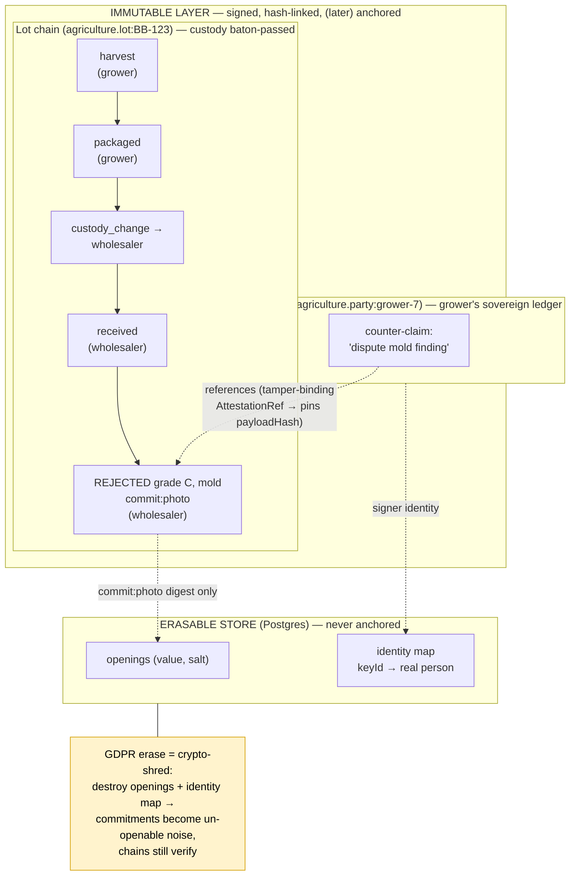

# Agriculture trust model — multi-actor mutability, erasure & backend evolution

**Status:** Design (decision doc). Defines how the agriculture registry answers the trust questions agrocontracts raised on a discovery call: what is immutable vs. alterable, who can remove data, multisig, how mutually-distrusting actors trust the platform, and what the storage backend choice (Postgres / P2P / blockchain) implies. Sibling of the agriculture backbone (`2026-06-11-agriculture-registry-backbone-design.md`), which it extends with the multi-actor dispute model and a GDPR-compliant erasure mechanism.
**Date:** 2026-06-26
**Author:** Claude + Piotr (brainstorm session)
**Spec type:** Trust / mutability / erasure / backend evolution
**Anchor case:** agrocontracts (https://www.agrocontracts.com/) — an ERP + WMS + track-and-trace product for soft-fruit growers. They ship packaged crops (e.g. blueberries) to wholesalers and retailers; returns and quality disputes today are reported informally (WhatsApp photos, paper). They want those records tamper-proof, want every actor able to dispute, and have a hard requirement to offboard / erase any party (GDPR). Their actors are **not tech-savvy and cannot run infrastructure** — the cryptography must be invisible.

> **Relationship to the backbone spec.** The 2026-06-11 backbone defines the agriculture registry's identity, disclosure, and registry layers against the Szulc workbook. This spec drills into the *multi-party trust dynamics* that the agrocontracts call surfaced: disputes between distrusting actors, the right to erasure, and the consequences of the storage substrate. Where the two overlap (commitments, custody, derivation links), this spec defers to the backbone and only adds the dispute + erasure deltas.

---

## 1. Context & problem

agrocontracts already has the operational system — ERP, warehouse management, track-and-trace. The gap is **trust between parties who don't trust each other, mediated by a platform they also don't fully trust.**

A grower packs a lot of blueberries and ships it to a wholesaler. The wholesaler inspects it and records a rejection: *"grade C, mold, see photo."* That record is commercially consequential — it determines payment, returns, and reputation. Three trust failures must be impossible:

1. The **grower** must not be able to make the rejection disappear.
2. The **platform operator** (agrocontracts) must not be able to alter or suppress it on anyone's behalf — even though the operator holds the keys and runs the database.
3. The **wholesaler** must not be able to fabricate a rejection the grower has no way to contest.

Simultaneously, two hard constraints pull the opposite direction:

- **Invisibility.** The actors report returns via WhatsApp photos today. They will not manage keys, run nodes, or "govern infrastructure." The trust machinery must be entirely hidden behind an ordinary app experience.
- **Erasure.** Any party must be removable on request (offboarding / GDPR Art. 17). This appears to contradict an immutable, tamper-proof ledger.

This spec resolves all of it without a consensus protocol and without putting the burden on the user.

## 2. The core decision: sovereign chains + cross-references ("Model B")

Two architectures were considered:

- **Model A — one shared chain per lot.** Every actor writes to a single canonical lot chain. To stop distrusting parties (and the operator) from rewriting shared state, this requires multi-writer authorization, co-signature, and **consensus on append order** — which is exactly the problem blockchains exist to solve, and a large departure from symblon's single-writer head-CAS. **Rejected** as premature complexity.

- **Model B — sovereign chains + cross-references. _Chosen._** Each actor and each lot is its own single-writer chain. Actors make statements *about* other chains via tamper-binding references, never by editing them. No shared mutable surface ⇒ no consensus protocol ⇒ no operator-editable battleground. This *also answers the operator-trust problem better than Model A*: a party's records live on that party's own chain, signed by that party's key — there is nothing for the operator to override.

Model B maps almost entirely onto primitives symblon already has (single-controller chains, custody handoff, derivation links, commitments). The only new core primitive is a generalized cross-chain reference (§5).

## 3. Chain architecture — two roles, one structure

Everything is a `Subject` + `Attestation` chain on the existing `IntegritySubstrate`. There is no new chain type in the engine; the two roles below are conventions on `Subject.scheme`.

### 3.1 Lot chains (`agriculture.lot`) — the goods, custody baton-passed

The canonical track-and-trace timeline for a physical lot. Custody passes grower → wholesaler → retailer via the existing `custody_change` event; the current controller is the **sole writer**. This is symblon's existing model verbatim — **zero new engine code.** Receiving, storage, and even a rejection-on-receipt are appended by whoever currently holds custody.

Splits (one grower lot → three wholesalers) and aggregations (many lots → one pallet) are modeled by the **existing derivation links** (`derivedFrom` / `consumedIn`), as already specified in the backbone §7.

### 3.2 Party chains (`agriculture.party`) — each actor's sovereign ledger

When an actor needs to make a statement they are *not entitled* to write on a lot chain — the canonical case being the grower **disputing** a wholesaler's rejection after custody has already moved away from them — that statement goes on the actor's **own** party chain. It is a signed attestation carrying a tamper-binding reference to the exact contested lot attestation.

Key consequences:

- The grower **cannot** edit the lot chain (they are no longer its controller) — this is the security property, not a limitation.
- The grower **can always** record a counter-claim on their own chain, and the operator **cannot** suppress it without it being a detectable, signed gap on a chain the grower co-holds receipts for. **This is the structural source of "place trust in our system": the right to dispute is unconditional and not operator-revocable.**
- The lot chain is never mutated by a dispute. The disagreement is a pinned cross-link pointing *in*.

### 3.3 The shape, in one diagram

The dispute (`grower-7` → `disputes` → the rejection) lives on the grower's own chain and only *points at* the rejection. The lot chain is never edited. The photo and the signer's real identity live in the erasable store; the chain holds only their digests.

### 3.4 The agriculture view — assembling the picture

A reader (buyer, auditor, the dispute UI) sees a lot's full story by reading the lot chain and surfacing every party-chain attestation that *references* it. The forward references are tamper-binding (in the chain); the **reverse index** ("what references attestation X?") is a query-layer concern, maintained in Postgres by the registry. The reverse index is a performance convenience, not a trust anchor — it can be rebuilt by scanning chains, and a missing entry cannot forge or hide a properly-signed reference held by the disputing party.

## 4. Disputes — v1 is counter-claim only

When the grower disputes the wholesaler's rejection, v1 records the grower's **own signed counter-statement** referencing the contested attestation. Both records stand; the disagreement is visible; **the system never adjudicates.** This is the trust primitive in its minimal form.

Explicitly deferred (not v1): arbiter rulings (a signed authoritative overlay by a co-op / cert body / agrocontracts staff), dispute workflow states (open → disputed → resolved), SLAs, and escalation. The counter-claim primitive is forward-compatible with all of these — an arbiter ruling is simply another typed cross-reference added later.

## 5. Engine delta — the generalized cross-chain reference

The **only** core-engine change for v1.

symblon currently has a transformation-specific reference: `derivedFrom` / `consumedIn` carrying an `AttestationRef` (`{ subject, attestationId, payloadHash }`), parsed by `parseDerivedFrom` / `parseConsumedIn` in `derivation.ts`. A dispute is the same *shape* of cross-reference with different *semantics* (it asserts a relationship *about* the target, not derivation *from* it).

Generalize it:

- Reuse `AttestationRef` and the internal `parseRef` (already tamper-binding: the `payloadHash` pins the target's exact content, so a reference cannot be silently re-pointed at a different version of the target).
- Add a reserved relationship key — `references` (with a relationship discriminator, e.g. `{ rel: "disputes", ref: AttestationRef }`) — parsed and validated by the engine the way `custody_change` and `derivedFrom` already are. The engine validates the ref is well-formed and tamper-binding; the *meaning* of `rel` stays in the agriculture domain (custody_change precedent: engine special-cases the reserved key, domain owns the semantics).
- Keep `derivedFrom` / `consumedIn` working unchanged (they become a documented special case of the general mechanism, or remain alongside it — an implementation choice for the plan).

No change to `verifyChain`, head-CAS, signing, or the substrate seam. Roughly a day of core work plus tests.

## 6. GDPR / erasure — crypto-shredding, not deletion

**The apparent contradiction** — "immutable ledger" vs. "erase any party on request" — dissolves under one rule: **plaintext personal data never enters the immutable layer.** It only ever appears as a salted commitment.

### 6.1 Mechanism

symblon's `commitments` (v0.2.0) already store fields in the chain as salted SHA-256 hashes, with the raw `(value, salt)` openings held in a **separate, mutable, erasable store** (Postgres) — never in the chain, never anchored. The identity mapping `keyId → real-world party` lives in the same erasable store.

To honor an erasure / offboarding request: **destroy the salt, the plaintext opening, and the identity mapping.** The commitment hash instantly becomes an un-openable, irreversible value — cryptographically indistinguishable from random noise — and the signing key becomes an **orphan pseudonym pointing at no one.** Because `payloadHash` covered the *commitment digest*, not the plaintext, every hash-link and signature still verifies. **Structure survives; personal content is unrecoverable.** This is crypto-shredding, the recognized approach for erasure in append-only systems.

This is also why **public anchoring stays compatible with erasure**: only commitment digests and structural hashes are ever anchored, so a post-shred anchor still references a value that no longer opens to anything.

### 6.2 What "remove a party" means — the honest definition

- **Supported (v1): erase the person.** Crypto-shred their personal data; unlink their identity so their key is an orphan pseudonym. The chain still verifies. The party is, for all practical and legal purposes, erased.
- **Not promised: expunge their signed records from history.** This would break every downstream chain that references them *and* likely violate the law agrocontracts operates under — **EU food-traceability (Reg. 178/2002 Art. 18)** mandates one-step-back / one-step-forward records, and **GDPR Art. 17(3) explicitly exempts data required for legal compliance.** Literal expunging is both self-defeating cryptographically and probably prohibited regulatorily.

The realistic, compliant shape is **selective erasure**: shred contact / identity data, retain the minimal legally-required transaction link, now pointing at an anonymized pseudonym. The agriculture registry is not working around GDPR — it implements GDPR correctly, including its retention carve-outs.

### 6.3 The hard architectural rule this imposes

**Personal data may only enter a chain as a commitment (`commitField`) — never as a plaintext `claim` field, never anything that gets anchored.** A name dropped into a plaintext claim becomes un-erasable. The identity/erasure module and the agriculture schema layer must make "personal data goes through `commitField`" the path of least resistance (schema-enforced where possible; reviewed otherwise).

### 6.4 New module: identity + erasure (not core)

A small package outside `@symblon/core`:

- `keyId → real-world party` registry, in the erasable Postgres store.
- A crypto-shred operation: given a party, destroy its openings + identity mapping, leaving the chains verifiable and the pseudonymous skeleton intact.
- Enforcement/guardrails for the §6.3 rule.

## 7. Multisig — v1 minimal, growth path defined

- **v1: single-signed custody handoff.** `custody_change` is signed by the *outgoing* controller (existing behavior). The receiving party's **first appended event is their implicit acceptance**; if they never agreed, they simply never append, and the lot chain idles at the handoff. No co-signature needed for a working, honest handoff.
- **Deferred: co-signed handoffs** (both parties sign the transfer — a bilateral receipt) and a **governance quorum** (N-of-M multisig for administrative corrections of disputed records, itself a signed, anchored action — the operator can never silently `DELETE`). These are the "consensus / governance" agrocontracts asked about; they live at the *platform policy* layer, run by the operator, never pushed onto farmers.

## 8. Backend evolution — Postgres now, P2P / blockchain later, no rewrite

The storage substrate is already abstracted behind one seam (`IntegritySubstrate`) with a shared conformance suite (`@symblon/substrate-conformance`, merged 2026-06-26). This is what makes the evolution safe: a new backend is a new implementation behind the same seam, validated to behave *identically*, and **the agriculture domain code does not change across any of them.**

| Stage | Substrate | Trust property gained | Cost to actors |
|---|---|---|---|
| **v1 (now)** | Postgres (`@symblon/substrate-sql`, merged) | Signed, hash-linked, head-CAS-guarded history; receipts give each party independent evidence | None — invisible, fast, fits agrocontracts' stack |
| **Later** | Hypercore / Autobase (P2P) | No single operator can *withhold* data — chains replicate to peers | App syncs silently in the background; still invisible |
| **Later** | Public Merkle anchoring (the "blockchain" step) | Once recorded, *nobody* — including the operator — can alter or delete without it being mathematically provable | None — only a hash root is published |

**Honest framing of the v1 (Postgres-only) trust claim:** records are signed, hash-linked, and every party holds a receipt — but during the pilot, actors still trust agrocontracts not to tamper, because the operator holds the keys and the database. The *architecture* already prevents silent forgery of a properly-signed third-party record; anchoring later upgrades the claim to "cannot cheat undetectably." The user has accepted starting centralized and adding P2P / anchoring later (decision, 2026-06-26).

## 9. The five agrocontracts questions — answer table

| Their question | Answer |
|---|---|
| **What's immutable?** | The signed history: hash-links, signatures, commitment digests, cross-references. Un-editable, un-reorderable. |
| **What can be altered?** | Forward *state* only, via new correction events that never overwrite. Personal data is erasable via crypto-shred. |
| **Who can remove data?** | Nobody silently. Personal data → crypto-shred on request (§6). Structural skeleton → retained (food-traceability law requires it). Future administrative corrections → governance quorum, signed and anchored, never a silent delete. |
| **Multisig?** | v1: single-signed custody handoff (receiver's first event = acceptance). Co-signed handoffs + governance quorum = deferred (§7). |
| **How do many actors trust you?** | The right to dispute is unconditional and not operator-revocable: a party always records a counter-claim on its *own* chain, signed by its *own* key, which the operator cannot suppress without a detectable signed gap (§3.2). Receipts give independent evidence; anchoring later makes tampering mathematically provable. |

## 10. v1 scope boundary

**In:** lot chains (existing) + party chains (convention) + the generalized cross-chain reference primitive (§5, the one core delta) + the identity/erasure module (§6.4) + the Postgres substrate (merged) + the agriculture view / reverse index (registry layer).

**Out (deferred, forward-compatible):** anchoring, P2P substrate, co-signed handoffs, governance quorum, arbiter rulings, dispute workflow states, SLAs.

## 11. What already exists vs. what to build

| Piece | Status |
|---|---|
| Single-writer lot chains + custody handoff | ✅ `@symblon/core` (custody_change, verifyChain, chain-state) |
| Commitments + presentations (GDPR foundation) | ✅ `@symblon/core` v0.2.0 |
| Derivation links (splits / aggregations) | ✅ `@symblon/core` v0.3.0 |
| Postgres substrate (v1 backend) | ✅ `@symblon/substrate-sql` (merged 2026-06-26) |
| Substrate conformance suite (safe backend evolution) | ✅ `@symblon/substrate-conformance` (merged 2026-06-26) |
| **Generalized cross-chain reference (disputes)** | ⬜ core delta (§5) |
| **Identity + erasure module (crypto-shred)** | ⬜ new package (§6.4) |
| **agriculture view / reverse-reference index** | ⬜ registry layer |
| Anchoring, P2P, co-signed handoffs, governance | ⬜ deferred (§7, §8) |

## 12. Open questions for the next pass

- Exact reserved-key shape for the generalized reference (`references` with a `rel` discriminator vs. distinct reserved keys per relationship). Resolve in the implementation plan.
- Whether `derivedFrom` / `consumedIn` are refactored to ride on the generalized mechanism or kept alongside it.
- Where the identity/erasure module lives in the workspace (`packages/identity`?) and its exact API surface.
- The reverse-index schema in the registry (likely an indexed `references` table keyed by target `(subject, attestationId)`).
